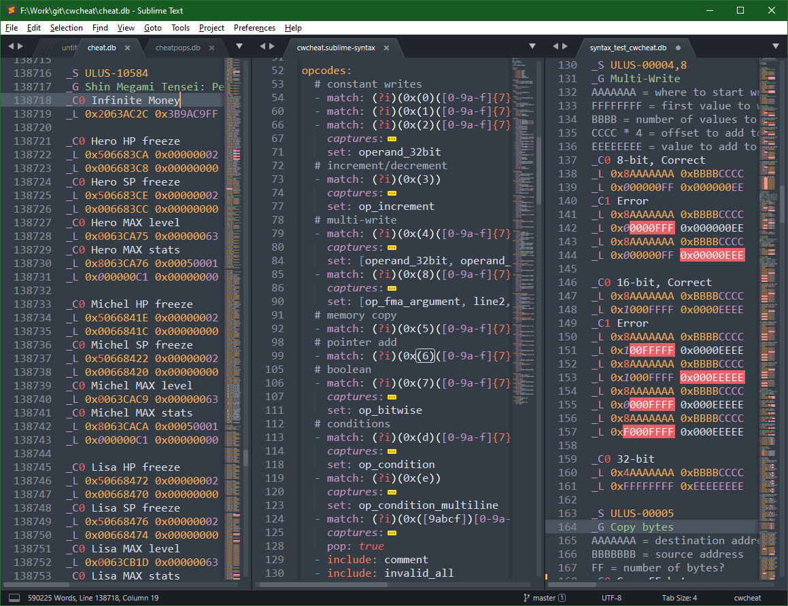

# CwCheat Syntax Highlighter for **PSP**

This is a CWCheat syntax highlighter for Sublime Text 3.

The syntax highlighter will try to mark various parts of the commands and arguments.

Currently support is implemented for all the types documented in [this CwCheat wiki](https://datacrystal.romhacking.net/wiki/CwCheat) plus some additional commands.

Not all commands are supported, some commands are impossible to check with the syntax highlighter alone.

